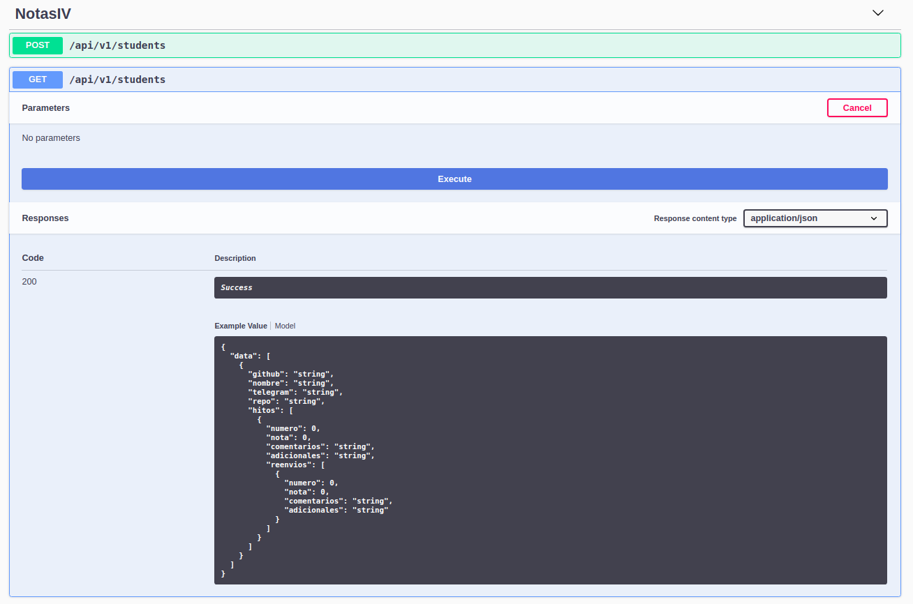

API
===

En esta sección se muestra la documentación de la API implementada para el microservicio. Primero se menciona la posibilidad
de visualizar la información con Swagger, y posteriormente en otra sección distinta se muestran los distintos métodos presentados
de una forma amigable y con links al código para ver su implementación en más detalle.

Swagger
-------

El paquete ``flask-restplus`` usado para el desarrollo de la API-RESTful, poniéndole una serie de decoradores
a los métodos, genera una documentación con Swagger que puede ser visualizada en el endpoint ``/`` de la API con Swagger UI
y muestra tanto los métodos disponibles como los modelos JSON devueltos por la API (aumenta el zoom en el navegador si no lo ves bien).

.. image:: images/swagger.png

Swagger UI también ofrece la posibilidad de probar la API cómodamente como si uśaramos Postman por ejemplo. Nos dice los outputs que ofrece
un endpoint y la posibilidad de hacer POST y PUT adjuntando cómodamente un JSON en el body de la petición.

.. image:: images/swagger_post.png

Para poder probar toda esta funcionalidad, simplemente puedes clonar el repositorio y dentro del mismo ejecutar:

.. code:: bash

    $ make
    $ make start (instalará pm2 globalmente en tu equipo).