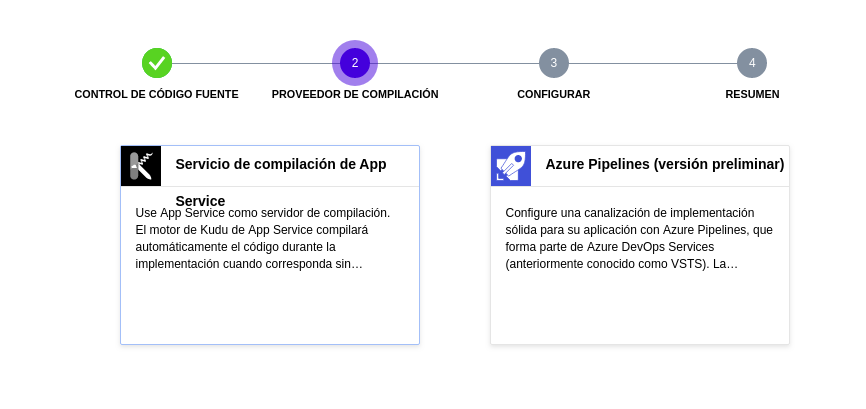

Despliegue en un PaaS
=====================

Heroku
------

La primera opción de PaaS que se ha usado es Heroku debido a su simpleza de uso para ir familiarizandome con despliegues.
Para configurar un despliegue desde la herramienta de construcción, se ha incluido la regla ``make heroku`` en el
``Makefile``. Esta regla contiene las siguientes acciones:

1. ``sudo snap install heroku --classic``: Instala el CLI de Heroku en Ubuntu con el gestor de paquetes **snap**.
2. ``heroku login``: Abre el navegador y nos pide introducir nuestros credenciales de Heroku para loguearnos en el CLI.
3. ``heroku create notas-iv --buildpack heroku/python``: Crea nuestra aplicación con nombre **notas-iv** con el buildpack
   de python que ofrece Heroku (aunque no era realmente necesario incluirlo ya que Heroku detecta el lenguaje de la app
   automaticamente), enlazando un repostiorio remoto a nuestro repositorio local.
4. ``git push heroku master``: Desplegamos nuestra aplicación en el repositorio remoto creado anteriormente.

Para saber cómo debe Heroku ejecutar nuestra aplicación, es necesario incluir un archivo llamado ``Procfile`` en la raiz
del proyecto con el siguiente contenido:

.. code:: bash

    web: make start-no-pm2

Debemos de poner el keyword ``web`` para decirle a Heroku que nuestra aplicación es un servicio web que recibirá peticiones
HTTP y nos habilita un puerto que deberemos asignar a nuestra aplicación con la variable de entorno ``$PORT``. Se ha creado una
regla ``start-no-pm2`` ya que no tiene sentido ejecutar nuestra aplicación en pm2 si ya el propio Heroku nos proporciona las
herramientas necesarias, como la escalabilidad por ejemplo.

Heroku y GitHub
***************

Cuando ya tenemos la aplicación desplegada, cada vez que hagamos un push a nuestro repo debemos de ejecutar
``git push heroku master`` para notificar a Heroku de los cambios y que actualice nuestra aplicación. Para
evitar esto, podemos configurar el repo de GitHub de nuestra aplicación para que cada vez que hagamos un push
a nuestro repo, automaticamente Heroku actualice la aplicación. 

Para ello simplemente debemos irnos al apartado **Deploy** en la página de nuestra aplicación en Heroku y
en el apartado *Deployment method* le damos a GitHub e introducimos nuestros credenciales de Github. Ahora solo
faltaría seleccionar el repo correspondiente a la aplicación.

Esto crea un hook en nuestro repo que se enlazará con Heroku cada vez que se introduzca un cambio. También nos da
la posibilidad de configurar si queremos que ese nuevo despliegue solo se lleve a cabo si la nueva versión de nuestro
repo pasa los tests en el CI que tengamos configurado en caso de tener alguno, sin necesidad de configurar nada mas.

En la siguiente imagen se puede ver como queda todo configurado despues de terminar el proceso:

Ahora simplemente cada vez que incluyamos un cambio en nuestro repo, Heroku ya se encargará de actualizar nuestra app
(siempre y cuando pase los tests correspondientes).

Azure Web Apps
--------------

Como segunda opción para complementar el despliegue con Heroku, se ha elegido Azure Web Apps ya que no pide tarjeta de crédito
y gracias al programa *GitHub Student Developer Pack* dan 100$ de crédito enlazando el correo de la UGR a la cuenta. 

.. Attention:: Antes de empezar a describir cómo se ha desplegado, hay que decir que me ha resultado imposible hacerlo con el CLI
   que proporciona (az), ya que incluso escribiendo los comandos tal cual explican en la documentación para desplegar la aplicación,
   da un error de Python del propio código del CLI y no he encontrado ninguna solución al fallo, por lo que he tenido que hacerlo
   mediante el portal web de Azure. De igual forma, para cada paso que haga incluiré los comandos que habría que ejecutar en el CLI
   para realizar lo mismo que haré mediante la web.

Dicho lo anterior, vamos a empezar. Una vez nos logueamos en el portal de Azure, nos saldrán unas cuantas opciones sobre lo que podemos
crear en la plataforma:

Para crear una aplicación web, debemos seleccionar la opción **App Services** y nos saldrá una plantilla con varias opciones que deberemos
rellenar:

* ``Grupo de recursos``: Contenedor que almacena los recursos relacionados con una solución de Azure. Simplemente creamos uno nuevo
  dándole el nombre que queramos, en mi caso **IV**.
* ``Nombre``: El nombree que queremos que tenga nuestra aplicación y que fomará parte de la URL de la misma en Azure.
* ``Publicar``: En nuestro caso, como queremos desplegar mediante un push desde GitHub, seleccionaremos la opción **Código**.
* ``Pila del entorno en tiempo de ejecución``: Lenguaje y versión del mismo que tendrá el contenedor de nuestra app.
* ``Región``: Al usar la suscripción de Azure para estudiantes con el correo de la UGR, solo podemos seleccionar *Central US* como región.

El resto de parámetros se rellenan automaticamente. En mi caso, se rellenaría tal que asi:

Para realizar estos mismos pasos desde el CLI, bastaría con ejecutar lo siguiente:

.. code:: bash

    $ az login
    $ az webapp up --sku F1 -n notas-iv -l centralus

Cuando lo tengamos todo, simplemente le damos al botón **Revisar y crear** en la parte inferior y esperamos a que se despliegue
la aplicación. Una vez terminado, si accedemos a la URL de nuestra app veremos que sale una página de Azure por defecto, ya que no
hemos desplegado todavía nuestro código y por defecto Azure tiene distintas plantillas en función del lenguaje de programación que
le hayamos indicado.

Azure y GitHub
**************

Ahora es el paso de indicarle a Azure qué código queremos desplegar. Para ello nos vamos a la sección **Centro de Implementación** en la
parte izquierda y veremos que nos oferce distintas posibilidades de despliegue de nuestro código:

Seleccionamos **GitHub**, luego nos saldrán 2 opciones de compilación de nuestra app, en nuestro caso elegimos **Kudu**, la primera opción:

Ahora nos pedirá que introduzcamos nuestro nick de GitHub, el repo y la rama que contiene el código que queremos desplegar:

.. Note:: Si por algun casual no salen los datos, es posible que primero haya que irse a la configuración de nuestra cuenta de GitHub
   y dar permisos a la aplicación Azure Web Apps en el apartado de **Aplicaciones**.

Una vez hecho esto, simplemente deberemos darle a **Finalizar** y nos saldrá una nueva tarea de compilación de la app, que montará un entorno
virtual e instalará las dependencias incluidas en el archivo **requirements.txt** (se ha debido de crear tal archivo ya que no aceptan un Pipfile):

.. image:: images/desplegando.png

Posteriormente, Azure buscará en el directorio raiz de nuestro repositorio un archivo llamado application.py o app.py si estamos usando
el microframework Flask, lo cual es nuestro caso, y lanzará un servidor de HTTP WSGI de Gunicorn en el puerto 5000:

.. code:: bash

    # If application.py
    $ gunicorn --bind=0.0.0.0 --timeout 600 application:app
    # If app.py
    $ gunicorn --bind=0.0.0.0 --timeout 600 app:app

En nuestro caso nos vale perfectamente, pero en mi caso particular estoy usando uWSGI, otra libreria parecida a Gunicorn asi que me interesaría usar
ésta, aparte de indicarle cómo quiero que se ejecute mi aplicación. Para ello, Azure ofrece la posibilidad de indicar un comando de inicio en la sección
de **Configuración**, donde además podemos indicar variables de entorno (aunque en este caso no nos haria falta, he declarado una variable ``$PORT``).

Esto estaría muy bien si no fuera porque no se pueden instalar paquetes adicionales como **make** para poder ejecutar **make start**, o si
simplemente se le indica como comando de inicio lo siguiente:

.. code:: bash

    $ uwsgi --http 0.0.0.0:$(PORT) --module app:app --master

No funciona, directamente dice que no encuentra el paquete uwsgi. Me he metido por SSH en los logs del contenedor y me he asegurado de que activa el entorno
virtual antes de lanzar el comando de inicio, por lo que ese no es el problema. Aparte, se ve perfectamente en los logs que lo instaló junto con el resto
de paquetes en ``requirements.txt``:

.. code:: bash

    [10:05:41+0000]     Running setup.py install for uwsgi: finished with status 'done'

Por lo tanto, he dejado la ejecución por defecto con Gunicorn que si funciona.