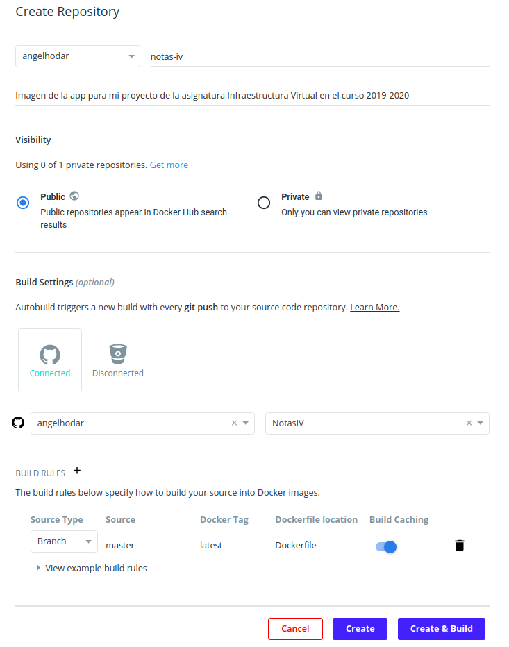
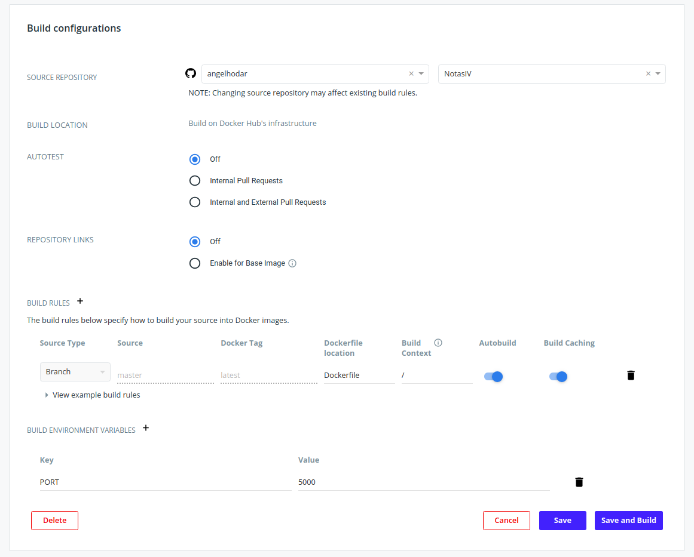
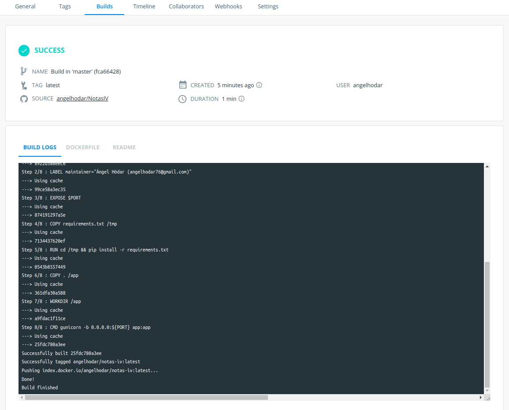
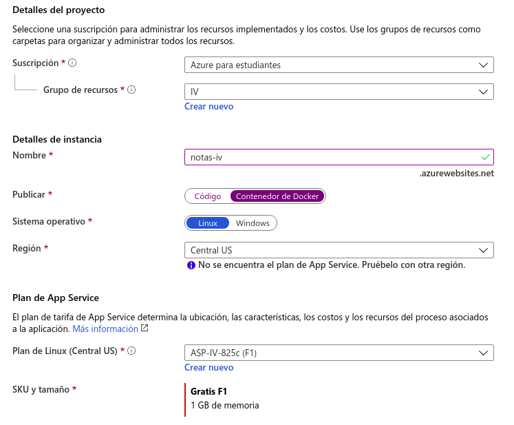
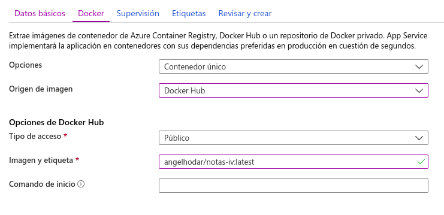

Docker
======

En esta sección se documentará la creación de un contenedor de docker para correr nuestra aplicación
de forma completamente aislada y solo con las dependencias estrictamente necesarias. Posteriormente,
se creará un repositorio en Docker Hub con la imagen creada y se usará para desplegar en Heroku y Azure.

Creación de la imagen
---------------------

Para crear la imagen necesitamos crear 2 archivos:

* ``Dockerfile``: Contiene los comandos que se usarán para crear la imagen.
* ``.dockerignore``: Funciona como un .gitignore, nos permite indicar qué archivos
  queremos que no se añadan a nuestra imagen ya que son innecesarios (por ejemplo el directorio **.git**).

El archivo Dockerfile está documentado paso por paso y contiene lo siguiente:

.. code:: bash

    # Usamos la versión alpine de la versión 3.7 de python yaa que es
    # mucho mas ligera (100MB vs 1GB)
    FROM python:3.7-alpine

    # Datos propios
    LABEL maintainer="Ángel Hódar (angelhodar76@gmail.com)"

    # Exponemos el puerto de la variable de entorno
    EXPOSE $PORT

    # Copiamos primero solo el requirements para aprovecharnos del sistema
    # de layers de las imagenes docker e instalamos las dependencias
    COPY requirements.txt /tmp
    RUN cd /tmp && pip install -r requirements.txt

    # Copiamos los archivos (solo los no añadidos en el .dockerignore)
    COPY . /app
    # Nos movemos al directorio creado previamente.
    WORKDIR /app

    # Finalmente ejecutamos la app escuchando en el puerto definido en PORT
    CMD gunicorn -b 0.0.0.0:${PORT} app:app

Una vez tenemos el ``Dockerfile`` creado, debemos situarnos en el mismo directorio y ejecutar:

.. code:: bash

    $ docker build -t notas-iv .

    Sending build context to Docker daemon  97.28kB
    Step 1/7 : FROM python:3.7-alpine
    ---> 8922d588eec6
    Step 2/7 : EXPOSE $PORT
    ---> Using cache
    ---> 82303a8b75d2
    Step 3/7 : COPY requirements.txt /tmp
    ---> Using cache
    ---> 2027a0d77ead
    Step 4/7 : RUN cd /tmp && pip install -r requirements.txt
    ---> Using cache
    ---> 90833d40b7ba
    Step 5/7 : COPY . /app
    ---> Using cache
    ---> 17725ae98b9b
    Step 6/7 : WORKDIR /app
    ---> Using cache
    ---> dc00b49afebb
    Step 7/7 : CMD gunicorn -b 0.0.0.0:${PORT} app:app
    ---> Using cache
    ---> 2a90f78a4ae6
    Successfully built 2a90f78a4ae6
    Successfully tagged notas-iv:latest

Esto creará una imagen llamada **notas-iv**, indicando con **.** el path donde está nuestro Dockerfile.
En este caso como ya se ha ejecutado previamente, vemos como usa la caché para no tener que ejecutar
cada comando de nuevo. Esto es especialmente interesante en el caso de la instalación de dependencias
con **pip**, ya que solo se ejecutará si cambiamos alguna dependencia, en lugar de hacerse siempre que
hagamos un cambio en el código por ejemplo.

Para listar las imagenes que tenemos creadas podemos ejecutar:

.. code:: bash

    $ docker images

    REPOSITORY            TAG                 IMAGE ID            CREATED             SIZE
    notas-iv              latest              0287ab292cdb        20 minutes ago      126MB

Para comprobar que la imagen funciona como debe, simplemente debemos arrancar un contenedor de esa imagen.
Para ello, simplemente ejecutamos:

.. code:: bash

    $ docker run -e PORT=$PORT -p $HOST_PORT:$PORT notas-iv

    [2019-11-21 15:04:40 +0000] [1] [INFO] Starting gunicorn 19.9.0
    [2019-11-21 15:04:40 +0000] [1] [INFO] Listening at: http://0.0.0.0:5000 (1)
    [2019-11-21 15:04:40 +0000] [1] [INFO] Using worker: sync
    [2019-11-21 15:04:40 +0000] [7] [INFO] Booting worker with pid: 7

La opción ``-p`` le indica que vamos a mapear el puerto ``$HOST_PORT`` del anfitrión al puerto ``$PORT`` del contenedor.
Basicamente esto quiere decir que si queremos acceder a nuestro contenedor localmente en la dirección **127.0.0.1:550** por ejemplo,
el valor de ``$HOST_PORT`` debe de ser **550**, mientras que el valor de ``$PORT`` deberá de ser aquel en el que queremos que escuche
nuestra app web dentro de su contenedor (en el caso de la ejecución anterior era **5000**).

Además, con la opción ``-e`` hacemos que el servidor WSGI de Gunicorn se ejecute escuchando en el puerto definido en la variable
de entorno ``$PORT`` mencionada anteriormente, algo necesario también posteriormente cuando se ejecuta en Heroku.

Docker Hub
----------

Ahora que ya tenemos nuestra imagen creada y funcionando, vamos a desplegarla en Docker Hub. Para ello primero nos registramos,
y cuando lo hayamos hecho le damos al boton **Create Repository** en en apartado de **Repositories**. Para automatizar la actualizacion
de la imagen cada vez que hagamos un push a nuestro repositorio, Docker Hub nos da directamente la opción de enganchar un repositorio de
GitHub desde donde obtener los datos para construir la imagen.

Si queremos que Docker Hub obtenga la información necesaria desde el repositorio de GitHub que le hemos asignado,
deberemos darle a **Create & Build**. Si por el contrario queremos subir la imagen manualmente, le damos a **Create**.

Si elegimos la segunda opción, debemos ejecutar tan solo 3 comandos para subir la imagen a Docker Hub:

.. code:: bash

    # Nos logueamos a nuestra cuenta de Docker Hub
    $ docker login

    # Cambiamos el nombre de la imagen con el del repo, añadiendo el tag que queramos.
    $ docker tag notas-iv angelhodar/notas-iv:latest

    # Sube la imagen al repo remoto.
    $ docker push angelhodar/notas-iv:latest

Ahora necesitamos un paso extra para automatizar las builds con GitHub, ya que si seleccionamos **Create & Build**
solo se crea en ese momento, pero no se tienen en cuenta futuros ``git push`` que se hagan en el repo.

En nuestro repositorio de Docker Hub, debemos irnos al apartado Builds y configurarlo de esta manera:

Una vez lo hayamos hecho, le damos al botón **Save and Build** y se iniciará una nueva build de nuestra imagen.
Cuando se complete nos deberá salir un resultado tal que asi:

Y con esto ya tendriamos Docker Hub completamente configurado y automatizado con nuestro repo de GitHub.

Depligue en Heroku
------------------

Desplegar nuestra imagen en Heroku es igual de sencillo que anteriormente. Para empezar, necesitamos estar
logueados en Heroku desde el CLI, asi que ejecutamos:

.. code:: bash

    $ heroku login

Seguimos los pasos que nos indica y ahora creamos nuestra app con el nombre que queramos, en mi caso va a ser **notas-iv**.

.. code:: bash

    $ heroku create notas-iv

    Creating ⬢ notas-iv... done
    https://notas-iv.herokuapp.com/ | https://git.heroku.com/notas-iv.git

Una vez tenemos la app creada, necesitamos crear un archivo llamado ``heroku.yml``, que tendrá una funcionalidad
parecida al ``Procfile``, pero esta vez se encargará de montar y correr la imagen que definamos en el Dockerfile
en la app que hemos creado previamente. El archivo tiene el siguiente formato:

.. code:: yaml

    build:
        docker:
            web: Dockerfile

Si nos fijamos es muy similar al ``Procfile``, tan solo le estamos diciendo que para montar nuestra app se va a usar docker utilizando
el proceso ``web``, y que todas las reglas necesarias para hacerlo están en nuestro Dockerfile. Cuando lo tengamos listo simplemente
debemos cambiar el stack de nuestra app a modo contenedor con el siguiente comando:

.. code:: bash

    $ heroku stack:set container

    Stack set. Next release on ⬢ notas-iv will use container.
    Run git push heroku master to create a new release on ⬢ notas-iv.

Esto provoca que heroku busque el archivo ``heroku.yml`` en lugar del ``Procfile``. Y ya solo falta hacer push de nuestra app
a Heroku (pongo algunas lineas de la salida para que se vea como usa el Dockerfile en lugar del Procfile):

.. code:: bash

    $ git push heroku master

    Contando objetos: 437, listo.
    Delta compression using up to 8 threads.
    Comprimiendo objetos: 100% (419/419), listo.
    Escribiendo objetos: 100% (437/437), 1.03 MiB | 11.93 MiB/s, listo.
    Total 437 (delta 257), reused 0 (delta 0)
    remote: Compressing source files... done.
    remote: Building source:
    remote: === Fetching app code
    remote: 
    remote: === Building web (Dockerfile)
    remote: Sending build context to Docker daemon   98.3kB
    remote: Step 1/8 : FROM python:3.7-alpine
    remote: 3.7-alpine: Pulling from library/python
    remote: 89d9c30c1d48: Pulling fs layer
    remote: 910c49c00810: Pulling fs layer
    remote: 7efe415eb85a: Pulling fs layer
    remote: 7d8d53519b81: Pulling fs layer
    remote: 519124ac136c: Pulling fs layer
    remote: 7d8d53519b81: Waiting
    remote: 519124ac136c: Waiting
    remote: 910c49c00810: Download complete
    remote: 7d8d53519b81: Verifying Checksum
    remote: 7d8d53519b81: Download complete
    remote: 519124ac136c: Download complete
    remote: 89d9c30c1d48: Verifying Checksum
    remote: 89d9c30c1d48: Download complete
    remote: 7efe415eb85a: Verifying Checksum
    remote: 7efe415eb85a: Download complete
    remote: 89d9c30c1d48: Pull complete
    remote: 910c49c00810: Pull complete
    remote: 7efe415eb85a: Pull complete
    remote: 7d8d53519b81: Pull complete
    remote: 519124ac136c: Pull complete
    remote: Digest: sha256:de9fc5bc46cb1a7e2222b976394ea8aa0290592e3075457d41c5f246f176b1bf
    remote: Status: Downloaded newer image for python:3.7-alpine
    remote:  ---> 8922d588eec6
    remote: Step 2/8 : LABEL maintainer="Ángel Hódar (angelhodar76@gmail.com)"
    remote:  ---> Running in 41e15861418b
    remote: Removing intermediate container 41e15861418b
    remote:  ---> c3e60445ce92
    remote: Step 3/8 : EXPOSE $PORT
    remote:  ---> Running in d619d3dc2b1b
    remote: Removing intermediate container d619d3dc2b1b
    remote:  ---> 804c40f0f5d6
    remote: Step 4/8 : COPY requirements.txt /tmp
    remote:  ---> d6fe1b20c339
    remote: Step 5/8 : RUN cd /tmp && pip install -r requirements.txt
    remote:  ---> Running in 9cfb5b9f4ed2

Una salida importante de este comando que no he mostrado es la siguiente:

.. code:: bash 

    remote: === Pushing web (Dockerfile)
    remote: Tagged image "6fb25269ffa2f2f648ce1fbeaf7de9a083b67b18" as "registry.heroku.com/notas-iv/web"
    remote: The push refers to repository [registry.heroku.com/notas-iv/web]

Basicamente lo que se hace cuando ejecutamos el comando anterior es hacer un pull de la imagen al
**Container Registry** de Heroku poniendole ese nombre concreto a la imagen (registry.heroku.com/notas-iv/web), que
contiene el nombre de nuestra app y el tipo de proceso que requiere nuestra aplicación (web), igual que cuando se
definía en el ``Procfile``.

Ya solo faltaría asociar la app al repo de GitHub para que se ejecute el despliegue con tan solo hacer git push a nuestro repo,
tal y como se hizo en la sección :ref:`heroku_github`.

Despliegue en Azure
-------------------

Desplegar en Azure es tremendamente sencillo, tan solo debemos crear un nuevo App Service y especificarle que queremos usar un contenedor Docker:

Al seleccionar docker, se nos abrirá una nueva pestaña en la que deberemos indicar qué imagen queremos usar y de dónde extraerla.
En nuestro caso, el proveedor de imagenes sería Docker Hub, especificandole la ruta completa de nuestra imagen, con el nombre del
repo y el tag que queremos usar:

Ahora tan solo debemos darle a **Revisar y crear** y nuestro contenedor estará desplegado y funcionando. Resulta extraño que no tengamos
que configurar ningun parámetro adicional, como la variable de entorno ``$PORT`` que necesita el contenedor para funcionar. Pero, si nos
fijamos en los logs que nos proporciona Azure, podemos ver cómo han ejecutado la imagen:

.. code:: bash

    $ docker run -d -p 7530:80 --name notas-iv_0_b168528e -e PORT=80 -e WEBSITE_SITE_NAME=notas-iv -e WEBSITE_HOSTNAME=notas-iv.azurewebsites.net

Hay incluso más variables de entorno en el comando, pero la que nos interesa especialmente es que utilizan una variable ``$PORT``.
En concreto, tiene valor **80**, algo esperable al tratarse de una app web.

    

